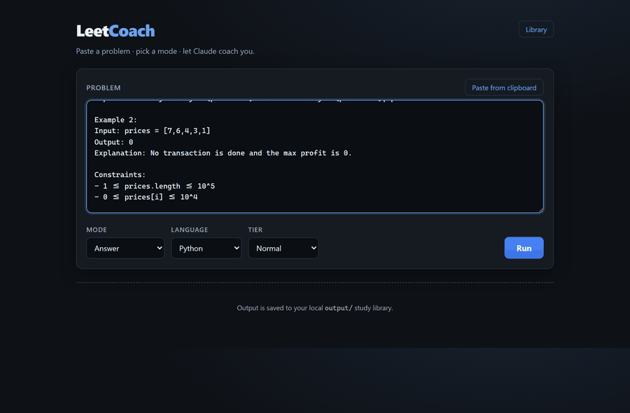
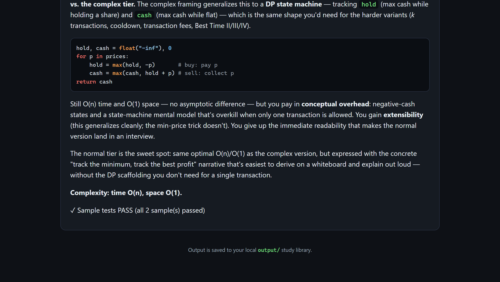

# LeetCoach

[](https://github.com/yib7/LeetCoach/actions/workflows/ci.yml)
[](LICENSE)
[](https://www.python.org/)

Paste a LeetCode problem, pick a language and a mode, and LeetCoach streams back study
material from the **`claude` CLI** and saves it to a growing local library. It runs the
generated Python against the problem's own sample I/O to tell you whether the solution
actually passes. No API key: it drives your existing Claude Code subscription through the
CLI.



## What it does

- **Three modes.** *Learning* teaches the stack a problem needs, *Guided Learning* walks
  from problem to solution in one document, and *Answer* gives a working solution with
  reasoning and Big-O.
- **Live streaming.** The response renders token by token in the browser over server-sent
  events, with markdown and syntax highlighting (no runtime CDN). A Stop button cancels
  a run mid-stream.
- **Self-checking.** Generated Python solutions are run against the problem's `Input:` /
  `Output:` examples in a throwaway sandbox and reported as PASS / FAIL.
- **Builds a library.** Every run is saved under `output/`, organized by problem type, and
  a topic index lets Learning skip and cross-link what you have already studied. A
  read-only Library panel in the UI browses everything you have saved.

<p align="center">
  
</p>

## How it works (the `claude` CLI dependency)

LeetCoach does not use an API key. It shells out to the `claude` command-line tool
(`claude -p`), which uses your **Claude Code subscription**. So before anything works you
need:

- The `claude` CLI installed and **on your PATH** (or point `LEETCOACH_CLAUDE_BIN` at its
  full path).
- That CLI **authenticated** (`claude` runs and answers from your normal shell).

If `claude` isn't found, the page still loads but shows a banner and runs fail until it's
installed and authenticated. There are no secrets to configure.

## Setup

Developed and tested on **Windows 11**; plain cross-platform Python with no OS-specific
dependencies. You need **Python 3.12+** (use the `py` launcher on Windows) and the
**`claude` CLI** installed, on your PATH, and authenticated (it drives your Claude Code
subscription; there is no API key).

**Step 1: get the code.**

```powershell
git clone https://github.com/yib7/LeetCoach.git
cd LeetCoach
```

**Step 2: install.** On Windows, one command creates the virtual environment and installs
the runtime dependencies:

```powershell
.\setup.ps1
```

(Not on Windows? Run `py -m venv .venv`, activate it, then `pip install -r requirements.txt`.)

**Step 3: run.**

```powershell
python app.py
```

Open the printed URL (default `http://127.0.0.1:5000`), paste a problem, pick a mode and
language (and tier), and click **Run**. The answer streams in live and is saved under
`output/`. `python app.py` is the single entry point for every later run.

(Optional) Copy `.env.example` to `.env` to change the model or paths; all settings are
optional, see [Configuration](#configuration).

## Modes

Two modes are **tiered**: *simple* (basic, possibly sub-optimal), *normal* (a balanced
interview answer), or *complex* (the most optimal solution).

- **Learning** (no tier) teaches the full stack a problem needs (data structures,
  algorithms, language stdlib). It uses the topic index to skip and cross-link topics you
  have already studied.
- **Guided Learning** (tiered) is one flowing document: restate the problem, teach the
  stack, reason step by step, then produce the answer.
- **Answer** (tiered) is a working solution plus reasoning, an explicit Big-O line, and the
  trade-off versus the other tiers.

## Add-ons

- **Sample-I/O verification.** Answer/Guided Python solutions are auto-checked against the
  problem's own examples (see the caveat below).
- **Topic index.** Learning records what you have covered in `topic_index.json` and feeds
  it back so later runs skip already-learned material.
- **Always-on Big-O.** Every Answer/Guided solution states explicit time and space
  complexity.

### Verification caveat

Verification is best-effort and **Python-first**:

- **Python** is first-class: the generated script reads the sample input on stdin and
  prints the result; LeetCoach runs it in a throwaway, secret-free sandbox and diffs stdout
  against the expected output to report PASS / FAIL. A failing run saves each failed
  sample's input, expected, and actual output into the reasoning file.
- **C++ / Java** are **not auto-verified**. LeetCoach only probes for a compiler (`g++` /
  `javac`); the result is shown as "not auto-verified". Verify those manually.
- When a problem has no parseable sample I/O, the result is likewise "not auto-verified". A
  not-verified result is never a failure.

The sandbox is a convenience check, not a security boundary; see [SECURITY.md](SECURITY.md).

## Tech stack

| Area | Choice |
| --- | --- |
| Language | Python 3.12+ |
| Web | Flask, server-sent events for streaming |
| Model | `claude` CLI (`claude -p`, stream-json), no API key |
| Front end | Vendored `marked` + `highlight.js`, dark single-page UI |
| Tests / lint | pytest (224 tests, all mocking the subprocess), ruff |

A 5-minute tour of the internals is in [docs/ARCHITECTURE.md](docs/ARCHITECTURE.md).

## Configuration

All six settings are environment variables, overridable in your shell or a `.env` file.
All are optional.

| Variable               | Default                        | What it does                                                        |
| ---------------------- | ------------------------------ | ------------------------------------------------------------------- |
| `LEETCOACH_MODEL`      | `claude-opus-4-8`              | Claude model id passed to `claude --model` (e.g. `opus` / `sonnet`).|
| `LEETCOACH_CLASSIFIER_MODEL` | `haiku`                  | Model for the short classification call that tags each run.        |
| `LEETCOACH_CLAUDE_BIN` | `claude`                       | Name or absolute path of the `claude` executable.                   |
| `LEETCOACH_OUTPUT_DIR` | `output` next to the app       | Where the study library is written.                                 |
| `LEETCOACH_TOPIC_INDEX`| `<output_dir>/topic_index.json`| Path to the persisted topic index JSON.                             |
| `LEETCOACH_RUN_TIMEOUT`| `600`                          | Wall-clock cap in seconds for a single `claude` run.                |

## Where outputs are saved

Everything lands under `output/` next to the app (gitignored, regardless of the
directory you launch from), organized by problem type:

```
output/
  learning/<problem_type>_learning/<problem>.md
  guided/<problem_type>/<problem>.md
  answers/<problem_type>/<problem>__<tier>.<ext>   (code)
  answers/<problem_type>/<problem>__<tier>.md      (reasoning + verification)
  topic_index.json
```

## Tests

All tests mock the `claude` subprocess, so the suite runs offline with no real Claude calls.

```sh
pip install -r requirements-dev.txt
py -m pytest -q
```

## License

[MIT](LICENSE). Third-party attributions are in [CREDITS.md](CREDITS.md); release notes in
[CHANGELOG.md](CHANGELOG.md).
