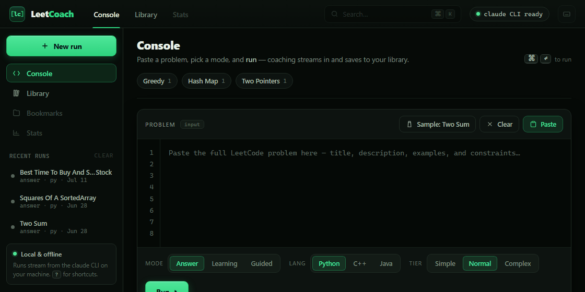
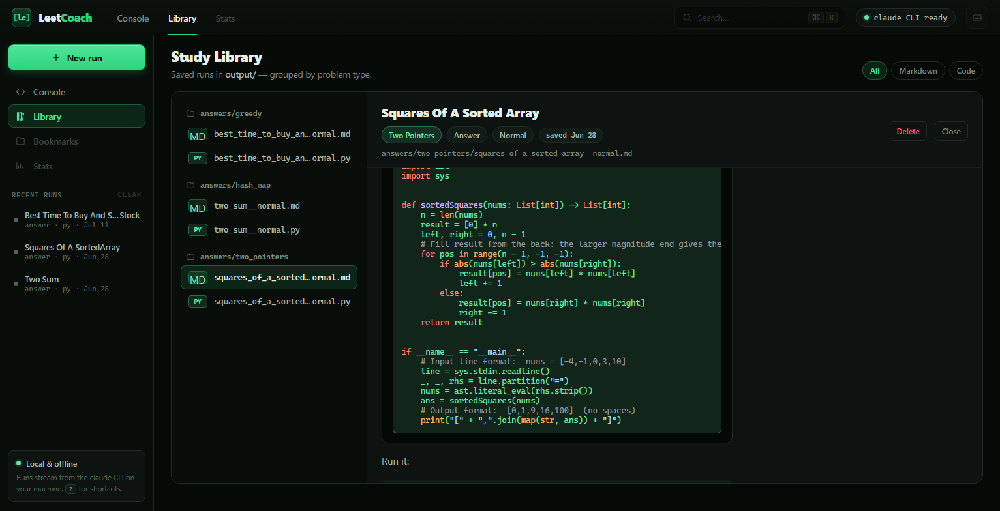

# LeetCoach

[](https://github.com/yib7/LeetCoach/actions/workflows/ci.yml)
[](LICENSE)
[](https://www.python.org/)

Paste a LeetCode problem, pick a language and a mode, and LeetCoach streams back study
material from the **`claude` CLI** and saves it to a growing local library. It runs the
generated Python against the problem's own sample I/O to tell you whether the solution
actually passes. No API key: it drives your existing Claude Code subscription through the
CLI.



## What it does

- **Four modes.** *Learning* teaches the stack a problem needs. *Guided Learning* walks
  from problem to solution in one document, with a ladder of hints you reveal one at a
  time. *Answer* gives a working solution with reasoning and Big-O. *Code Review*
  critiques your own attempt without rewriting it.
- **One study-doc structure.** Every doc follows the same outline: the problem in brief,
  the target complexity, how to recognise the pattern, the key insight, the approach, the
  solution, edge cases, common mistakes, related problems and flashcards. Problems are
  filed under a fixed list of about 18 patterns.
- **Live streaming.** The response renders token by token over server-sent events, with
  markdown and syntax highlighting and no runtime CDN. The view follows the stream, shows
  the current phase (streaming, verifying, saving) and the model that answered. A Stop
  button cancels a run mid-stream.
- **Self-checking.** Generated Python solutions run against the problem's `Input:` /
  `Output:` examples in a throwaway sandbox and are reported as PASS / FAIL.
- **Builds a library.** Every run is saved under `output/` and organised by pattern. Each
  problem gets a record (number, title, difficulty, statement) and every run is logged.
  The Library tab browses and deletes saved runs. The Console sidebar lists your recent
  runs, and your draft problem and settings survive a reload.
- **A practice loop.**
  - **Re-attempt** a saved problem with the answer hidden, and use **Test my code** to
    run your own Python against the samples and your own cases.
  - Grade yourself (solo / with hints / peeked) and a **spaced-repetition review queue**
    (1, 3, 7, 14, 30 days) brings the problem back when it is due.
  - Keep **notes** per problem.
  - Flip through **flashcards** from your docs, or export them to Anki.
- **Follow-up questions.** Ask a question about any saved doc in the library viewer. The
  answer streams in and is appended to the doc. When possible it resumes the original
  Claude session; otherwise it sends the doc as context.
- **Tracks your practice.** A Stats tab, computed from the run log, shows:
  - a daily streak, with a badge in the Console header;
  - an activity heatmap;
  - totals by topic, mode and language;
  - review counts.

  A `Ctrl`/`Cmd`+`K` search palette jumps to any saved problem, and `?` shows the
  keyboard shortcuts.
- **Quick Ask.** A side box answers a small syntax or stdlib question with a cheap model
  (Haiku by default, `LEETCOACH_QUICK_ASK_MODEL`), without streaming or saving anything. It
  refuses to hand over the current problem's solution but still answers abstract
  questions such as "what does `defaultdict` do?".

<p align="center">
  
</p>

## How it works (the `claude` CLI dependency)

LeetCoach does not use an API key. It shells out to the `claude` command-line tool
(`claude -p`), which uses your **Claude Code subscription**. So before anything works you
need:

- The `claude` CLI installed and **on your PATH** (or point `LEETCOACH_CLAUDE_BIN` at its
  full path).
- That CLI **authenticated** (`claude` runs and answers from your normal shell).

If `claude` isn't found, the page still loads but shows a banner, and runs fail until it's
installed and authenticated.

If it's installed but signed out, the banner says so and gives you the exact command to
sign in: `claude auth login`. The desktop shortcut (`LeetCoach.cmd`) checks
`claude auth status` before starting the app. If you are signed out, it opens
`claude auth login` in its own window and waits for you. It never blocks the app from
starting.

If a run fails, the error shows the CLI's own reason, such as an expired login, a usage
limit or an unknown model. It says "signed out" only when the CLI reports that.

There are no secrets to configure.

LeetCoach runs every `claude` call in isolation:
- `--safe-mode`, no tools, no MCP servers, and its own system prompt;
- a neutral working folder (`LEETCOACH_CLAUDE_CWD`), so your plugins, hooks,
  `CLAUDE.md` and output style never shape a study doc.

See [SECURITY.md](SECURITY.md).

## Setup

Developed and tested on **Windows 11**; plain cross-platform Python with no OS-specific
dependencies. You need **Python 3.12+** (use the `py` launcher on Windows) and the
**`claude` CLI** installed, on your PATH, and authenticated (it drives your Claude Code
subscription; there is no API key).

**Step 1: get the code.**

```powershell
git clone https://github.com/yib7/LeetCoach.git
cd LeetCoach
```

**Step 2: install.** On Windows, one command creates the virtual environment and installs
the runtime dependencies:

```powershell
powershell -ExecutionPolicy Bypass -File .\setup.ps1
```

(`-ExecutionPolicy Bypass` sidesteps the default policy that blocks unsigned scripts, for
this one process only - it changes nothing system-wide. Every LeetCoach `.ps1`/`.cmd`
launcher, including `LeetCoach.cmd` itself, invokes scripts this same way.)

(Not on Windows? Run `python3 -m venv .venv`, activate it, then `pip install -r requirements.txt`.)

**Step 3: run.** Activate the virtual environment, then start the app:

```powershell
.\.venv\Scripts\Activate.ps1
python app.py
```

Open the printed URL (default `http://127.0.0.1:5000`), paste a problem, pick a mode,
language, and Code Quality level (and, if you like, a model), and click **Run**. The
answer streams in live and is saved under `output/`. `python app.py` is the single entry
point for every later run.

**Daily use.** After the one-time setup you do not need the terminal. Run
`powershell -ExecutionPolicy Bypass -File .\scripts\create-shortcut.ps1` once to put a
**LeetCoach** shortcut on your Desktop; from then on, double-click it (or run
`.\LeetCoach.cmd`) to start the app and open it in your browser. If port 5000 is busy it
picks the next free port. Close the window to stop the app.

(Optional) Copy `.env.example` to `.env` to change the model or paths; all settings are
optional, see [Configuration](#configuration).

## Modes

Two modes take a **Code Quality** level: *Basic* (the simplest approach, possibly
sub-optimal), *Normal* (a balanced interview answer), or *Optimal* (the best time/space
solution).

- **Learning** (no Code Quality level) teaches the full stack a problem needs (data
  structures, algorithms, language stdlib). It uses the topic index to skip and cross-link
  topics you have already studied.
- **Guided Learning** is one flowing document: restate the problem, teach the stack,
  reason step by step, then produce the answer at the chosen level.
- **Answer** is a working solution plus reasoning, an explicit Big-O line, and the
  trade-off versus the other levels.
- **Code Review** (no Code Quality level) takes a second box, *Your code*, and critiques
  your attempt (bugs, complexity, edge cases) without rewriting it.

Guided and Learning docs end their teaching with `### Hint 1..4`, shown click-to-reveal,
and Learning never contains an end-to-end solution.

## Add-ons

- **Sample-I/O verification.** Answer/Guided Python solutions are auto-checked against the
  problem's own examples (see the caveat below).
- **Topic index.** Learning and Guided record what you have covered (per language) in `topic_index.json` and feed
  it back so later runs skip already-learned material.
- **Always-on Big-O.** Every Answer/Guided solution states explicit time and space
  complexity.

### Verification caveat

Verification is best-effort and **Python-first**:

- **Python** is first-class: the generated script reads the sample input on stdin and
  prints the result; LeetCoach runs it in a throwaway, secret-free sandbox and diffs stdout
  against the expected output to report PASS / FAIL. A failing run saves each failed
  sample's input, expected, and actual output into the reasoning file.
- **C++ / Java** are **not auto-verified**. LeetCoach only probes for a compiler (`g++` /
  `javac`); the result is shown as "not auto-verified". Verify those manually.
- When a problem has no parseable sample I/O, the result is likewise "not auto-verified". A
  not-verified result is never a failure.

The sandbox is a convenience check, not a security boundary; see [SECURITY.md](SECURITY.md).

## Tech stack

| Area | Choice |
| --- | --- |
| Language | Python 3.12+ |
| Web | Flask, server-sent events for streaming |
| Model | `claude` CLI (`claude -p`, stream-json), no API key |
| Front end | Vendored `marked` + `highlight.js`, dark application-shell UI (Console, Library, Stats) |
| Tests / lint | pytest (1,300+ tests, all mocking the subprocess), zero-dependency node tests for the front-end helpers, ruff |

A 5-minute tour of the internals is in [docs/ARCHITECTURE.md](docs/ARCHITECTURE.md).

## Configuration

Settings are environment variables. You can override them in your shell or in a `.env`
file, and all of them are optional. `.env.example` lists the user settings, ready to copy
to `.env`. The three path settings ship commented out there; the table below explains
why. Every timeout is clamped to (0, 86400] seconds, and an invalid value falls back to
the default.

| Variable               | Default                        | What it does                                                        |
| ---------------------- | ------------------------------ | ------------------------------------------------------------------- |
| `LEETCOACH_MODEL`      | `opus`                         | Model passed to `claude --model` for study runs and follow-ups. Use an alias (see below) or pin a full model id. The Console model picker writes this for you, and you can also pick a model per run. |
| `LEETCOACH_CLASSIFIER_MODEL` | `haiku`                  | Model for the short classification call that tags each run with a pattern and topics. |
| `LEETCOACH_QUICK_ASK_MODEL`  | `haiku`                  | Model for the Quick Ask box. The page's Quick Ask tag shows this value. |
| `LEETCOACH_CLAUDE_BIN` | `claude`                       | Name or absolute path of the `claude` executable. The launcher's sign-in check honours it too. |
| `LEETCOACH_OUTPUT_DIR` | `output` next to the app       | Where the study library is written. By default it is relative to the app's own folder. If you set a relative value here, it resolves against your current working directory instead, which is why it's commented out in `.env.example`. |
| `LEETCOACH_TOPIC_INDEX`| `<output_dir>/topic_index.json`| Path to the persisted topic index JSON. The same relative-path caveat applies. |
| `LEETCOACH_CLAUDE_CWD` | `%LOCALAPPDATA%\LeetCoach\claude-cwd` (Windows), `~/.local/share/leetcoach/claude-cwd` (elsewhere) | Neutral folder every `claude` call runs in. The CLI never loads this repo's `CLAUDE.md` or settings, and LeetCoach's saved sessions, which follow-ups resume, stay out of your own projects' Claude Code history. Created on demand. |
| `LEETCOACH_RUN_TIMEOUT`| `600`                          | Wall-clock cap, in seconds, for a single `claude` run. |
| `LEETCOACH_VERIFY_TIMEOUT`| `10`                        | Wall-clock cap, in seconds, for each sandboxed sample check (Answer/Guided verification and Test my code). |
| `LEETCOACH_NO_BROWSER`   | *(unset)*                      | Set to `1`/`true`/`yes` to stop `python app.py` opening your browser on launch. |
| `LEETCOACH_NO_DOTENV`    | *(unset)*                      | Set to `1`/`true`/`yes` to skip loading `.env` entirely and use real environment variables only. |
| `LEETCOACH_DOTENV_PATH`  | `.env` next to the app         | **Dev/test only.** Where the model picker writes its choice. The test suite and `scripts/dev/run_fake.py` point it at a scratch file. Startup always loads the `.env` next to the app, not this path. |

`setup.ps1` also reads `LEETCOACH_SETUP_PYTHON_EXE`, a **test-only** override for the
Python it bootstraps with. The fake CLI in `scripts/dev/` reads its own `FAKE_*`
variables. Neither is an app setting.

**Model aliases.** The picker offers `fable`, `opus`, `sonnet` and `haiku`. The alias
itself is what reaches `claude --model`, so it always tracks the CLI's newest model of
that family. The picker tooltips and the model chip show the concrete version from
`config.LATEST_MODEL_IDS`, a display-only table:

| Alias    | Shown as (as of this release) |
| -------- | ----------------------------- |
| `fable`  | `claude-fable-5-1` (Fable 5.1, the most capable) |
| `opus`   | `claude-opus-5-5` (Opus 5.5, the default) |
| `sonnet` | `claude-sonnet-5-5` (Sonnet 5.5) |
| `haiku`  | `claude-haiku-5-5` (Haiku 5.5) |

If you pin a full id in `.env` (for example `LEETCOACH_MODEL=claude-sonnet-4-5`), it is
kept when you pick the matching alias for a run.

## Where outputs are saved

Everything lands under `output/` next to the app (gitignored, regardless of the
directory you launch from), organized by problem type:

```
output/
  learning/<pattern>_learning/<problem>.md
  guided/<pattern>/<problem>.md
  answers/<pattern>/<problem>__<level>.<ext>   (code; <level> = basic|normal|optimal)
  answers/<pattern>/<problem>__<level>.md      (reasoning + verification)
  reviews/<pattern>/<problem>__review.md       (Code Review)
  _unsorted/<hash>.md                          (only if a normal save failed)
  topic_index.json
  .leetcoach/                                  (app metadata, hidden from the Library)
    problems/<problem_id>.json                 (problem record: statement, notes, review schedule)
    runs.jsonl                                 (append-only run log; drives Stats)
```

A re-run with the same settings gets a `__2`, `__3`, ... suffix instead of overwriting.
Follow-up answers are appended to the doc they were asked on. Libraries saved before
1.5.0 need no migration: their files still open, count in Stats, and accept follow-ups.

## Limitations

- **Single-user localhost tool.** No accounts, no auth, no multi-user; it binds to
  loopback and is not meant to be exposed on a network.
- **Only Python is auto-verified.** C++ / Java solutions are compiler-probed only and
  reported "not auto-verified"; verify those yourself.
- **The sandbox is a convenience, not a security boundary.** It caps time, memory, and
  process count, but do not rely on it to contain hostile code; see [SECURITY.md](SECURITY.md).
- **Requires the `claude` CLI.** It drives your Claude Code subscription through the CLI;
  there is no API-key fallback, so runs fail until `claude` is installed and authenticated.

## Tests

All tests mock the `claude` subprocess, so the suite runs offline with no real Claude calls.

```sh
pip install -r requirements-dev.txt
python -m pytest -q        # includes the node tests below when node is installed
node tests/js/run.js       # front-end helper tests (zero dependencies)
ruff check .
```

To click through the app without spending anything, run
`python scripts/dev/run_fake.py`. It starts LeetCoach on `http://127.0.0.1:5057` against a
fake `claude` with canned answers and a freshly seeded scratch library. It never calls
the real CLI or touches your `output/` or `.env`. Pass `--keep` to keep the previous
scratch library.

## License

[MIT](LICENSE). Third-party attributions are in [CREDITS.md](CREDITS.md); release notes in
[CHANGELOG.md](CHANGELOG.md).
