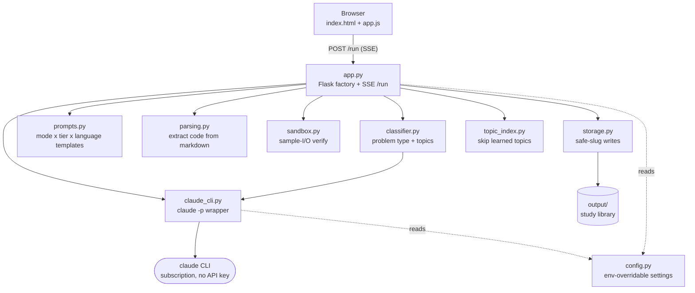
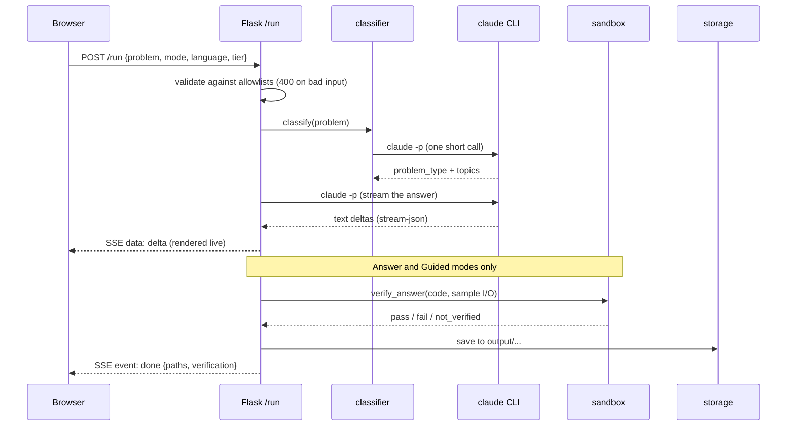

# Architecture

A five-minute tour of how LeetCoach is put together, for anyone reading the code for
the first time.

## What it is

LeetCoach is a small Flask web app that runs on `localhost`. You paste a LeetCode-style
problem, pick a language and a mode, and the app shells out to the **`claude` CLI**
(`claude -p`, no API key) to generate study material. The response streams back to the
browser live over server-sent events (SSE) and is saved under `output/` so your notes
accumulate into a personal study library.

There is one external dependency that does the heavy lifting (the `claude` CLI) and a
handful of small, single-purpose Python modules around it. Nothing here talks to a
database or a cloud service.

## How the pieces fit



## What happens on a run



## The modules

| Module | Responsibility |
| --- | --- |
| `app.py` | Flask app factory and the streaming `/run` endpoint. Validates input, orchestrates classify → prompt → stream → verify → save, and emits SSE events. The Claude runner is injectable so tests never spawn a real process. |
| `claude_cli.py` | The keystone. Wraps `claude -p --output-format stream-json`. The prompt is piped on **stdin** (never argv), and the stream-json output is parsed into incremental text deltas. |
| `classifier.py` | One short Claude call to label the problem (a `problem_type` slug plus a topic list). Never raises; falls back to `uncategorized`. |
| `prompts.py` | Prompt templates per mode x tier x language, with the always-on Big-O instruction. |
| `parsing.py` | Pulls the runnable code block out of Claude's markdown answer. Flask-free so the sandbox can import it. |
| `sandbox.py` | Best-effort sample-I/O verification: runs the generated Python against the problem's examples in a throwaway, secret-free directory with a timeout. |
| `storage.py` | Writes outputs under `output/`. The `slug()` function is the single containment chokepoint that keeps every write inside the output tree. |
| `topic_index.py` | Records what Learning has covered and feeds it back so later runs skip and cross-link known topics. |
| `config.py` | All machine-specific settings, read from the environment at call time (model id, `claude` binary, output dir, topic-index path). |

## Design decisions worth knowing

- **No API key.** The app uses your Claude Code subscription via the CLI. There is no
  secret to configure or leak.
- **Injectable Claude runner.** `claude_cli.run` and `create_app` both take an injectable
  runner, so the whole suite mocks the subprocess and runs offline. No test spawns a real
  `claude`.
- **Prompt on stdin.** A pasted problem can be large; sending it on stdin avoids argument
  length limits and any shell-escaping surface.
- **One containment chokepoint.** Every user/model-supplied path segment goes through
  `storage.slug()` before it touches the filesystem.
- **The sandbox is a convenience, not a security boundary.** See [SECURITY.md](../SECURITY.md).

## Environment and commands

- Windows 11 with PowerShell is the developed/tested platform; the code is plain
  cross-platform Python with no OS-specific dependencies.
- Python 3.12+ (via the `py` launcher on Windows). A project `.venv` is recommended.
- The `claude` CLI must be installed, on your PATH, and authenticated.

```sh
py -m pytest -q          # run the tests (all mock the claude subprocess)
python app.py            # run the app, then open the printed localhost URL
py -m ruff check .       # lint
```

`scripts/smoke_claude.py` is a small developer utility that makes one real `claude -p`
call to confirm streaming works on your machine. It is never part of the test suite.
