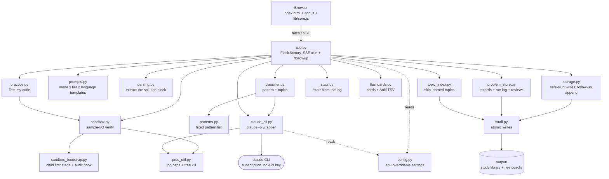
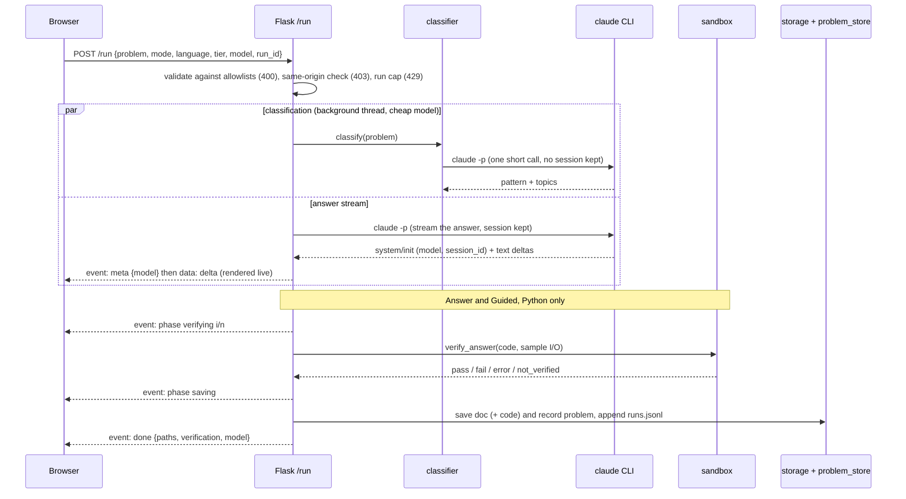

# Architecture

A short tour of how LeetCoach fits together, for anyone reading the code for the first
time.

## What it is

LeetCoach is a small Flask web app that runs on `localhost`. You paste a LeetCode-style
problem and pick a language and a mode. The app then shells out to the **`claude` CLI**
(`claude -p`, no API key) to generate study material. The response streams back to the
browser live over server-sent events (SSE) and is saved under `output/`, so your docs
accumulate into a personal study library.

The library also feeds a practice loop:

- problem records and an append-only run log;
- re-attempts with "Test my code" in the sandbox;
- a spaced-repetition review queue;
- notes and flashcards;
- follow-up questions appended to a saved doc.

One external dependency does the heavy lifting: the `claude` CLI. Around it sit a
handful of small, single-purpose Python modules and two front-end scripts. Nothing talks
to a database or a cloud service. All state lives in files under `output/`.

## How the pieces fit


```mermaid
flowchart TD
    Browser["Browser<br/>index.html + app.js + lib/core.js"]
    App["app.py<br/>Flask factory, SSE /run + /followup"]
    Cli["claude_cli.py<br/>claude -p wrapper"]
    Classifier["classifier.py<br/>pattern + topics"]
    Patterns["patterns.py<br/>fixed pattern list"]
    Prompts["prompts.py<br/>mode x tier x language templates"]
    Parsing["parsing.py<br/>extract the solution block"]
    Sandbox["sandbox.py<br/>sample-I/O verify"]
    Boot["sandbox_bootstrap.py<br/>child first stage + audit hook"]
    Practice["practice.py<br/>Test my code"]
    Proc["proc_util.py<br/>job caps + tree kill"]
    Storage["storage.py<br/>safe-slug writes, follow-up append"]
    Store["problem_store.py<br/>records + run log + reviews"]
    Stats["stats.py<br/>/stats from the log"]
    Cards["flashcards.py<br/>cards + Anki TSV"]
    Fs["fsutil.py<br/>atomic writes"]
    Topic["topic_index.py<br/>skip learned topics"]
    Config["config.py<br/>env-overridable settings"]
    Claude(["claude CLI<br/>subscription, no API key"])
    Output[("output/<br/>study library + .leetcoach/")]

    Browser -->|"fetch / SSE"| App
    App --> Classifier
    Classifier --> Patterns
    App --> Prompts
    App --> Parsing
    App --> Sandbox
    App --> Practice
    Practice --> Sandbox
    Sandbox --> Boot
    Sandbox --> Proc
    App --> Storage
    App --> Store
    App --> Stats
    App --> Cards
    App --> Topic
    Classifier --> Cli
    App --> Cli
    Cli --> Claude
    Cli --> Proc
    Storage --> Fs
    Store --> Fs
    Topic --> Fs
    Fs --> Output
    App -.->|reads| Config
    Cli -.->|reads| Config
```

## What happens on a run


```mermaid
sequenceDiagram
    participant U as Browser
    participant F as Flask /run
    participant CL as classifier
    participant CC as claude CLI
    participant SB as sandbox
    participant ST as storage + problem_store

    U->>F: POST /run {problem, mode, language, tier, model, run_id}
    F->>F: validate against allowlists (400), same-origin check (403), run cap (429)
    par classification (background thread, cheap model)
        F->>CL: classify(problem)
        CL->>CC: claude -p (one short call, no session kept)
        CC-->>CL: pattern + topics
    and answer stream
        F->>CC: claude -p (stream the answer, session kept)
        CC-->>F: system/init (model, session_id) + text deltas
        F-->>U: event: meta {model} then data: delta (rendered live)
    end
    Note over F,SB: Answer and Guided, Python only
    F-->>U: event: phase verifying i/n
    F->>SB: verify_answer(code, sample I/O)
    SB-->>F: pass / fail / error / not_verified
    F-->>U: event: phase saving
    F->>ST: save doc (+ code) and record problem, append runs.jsonl
    F-->>U: event: done {paths, verification, model}
```

A `: ping` comment is sent every ~15 s while the CLI is thinking, so a closed tab is
noticed. `POST /run/cancel {run_id}` stops a run, and nothing is saved.

## Follow-up questions (D6)

`POST /followup {path, question}` streams an answer to a question about a saved `.md` doc
and appends it to that doc under `## Follow-up — <question>`.

1. The server looks up the doc's `session_id` in `runs.jsonl`, taking the most recent
   study run whose files include the path.
2. If there is a session and `claude --help` lists `--resume`, it runs
   `claude -p --resume <id>`. The run uses the same isolation flags and neutral cwd as a
   study run, with session persistence on.
3. Otherwise it falls back to a fresh isolated call with the doc as fenced context,
   capped at 24k chars. The fallback also runs when the resume fails before any text.
   The `phase`/`done` events say which source answered (`resume` or `fallback`).
4. The answer is sanitised so it cannot add H1/H2 headings or forge the verdict. It is
   then appended atomically under the storage lock and logged as a `followup` entry.
   Stats does not count these entries.

One follow-up runs at a time, on a slot separate from `/run`. `POST /followup/cancel`
stops it.

## Quick Ask

`POST /ask` is a lightweight side channel next to the main study flow. It takes a small
syntax, standard-library or concept question and answers it in a few sentences. It uses
the same injected Claude runner as `/run`, pointed at the cheap Quick Ask model (Haiku by
default; see `config.quick_ask_model()`). The page's Quick Ask tag shows that configured
model.

It is a lookup, not a lesson: the reply is plain JSON rather than an SSE stream, and
nothing is written to the library. `prompts.build_quick_ask` carries a guardrail so the
cheap model refuses questions that really ask how to solve the current problem. A
deliberate carve-out keeps genuinely abstract questions ("what does `defaultdict` do?")
answerable. When a problem is pasted, it is fenced as context and used only for that
guardrail.

## Routes

These are all the routes in `app.url_map`. Every request must come from a loopback
address and pass the loopback `Host` check. Unsafe methods (POST/PUT/DELETE) also pass
the same-origin check. `/run` and `/ask` each allow 4 calls in flight (429 past that).

| Method | Route | What it does |
| --- | --- | --- |
| GET | `/` | The single page. It shows the CLI sign-in banner from a cached `claude auth status` probe. |
| GET | `/healthz` | `{"app": "leetcoach", "version"}`. A second launch uses it to find a running instance. |
| GET | `/favicon.ico` | The app icon (`static/favicon.svg`), for pages without the `<link rel="icon">` (JSON and plain-text routes). |
| POST | `/run` | Study run (Answer / Learning / Guided / Code Review) as an SSE stream. |
| POST | `/run/cancel` | Cancel a run by `run_id`. |
| POST | `/followup` | Follow-up question on a saved doc, as an SSE stream (see above). |
| POST | `/followup/cancel` | Cancel a follow-up by `followup_id`. |
| POST | `/ask` | Quick Ask (plain JSON). |
| POST | `/ask/cancel` | Cancel a Quick Ask. |
| POST | `/config/model` | Model picker: validates the alias and upserts `LEETCOACH_MODEL` into `.env`. |
| GET | `/library` | Lists the library tree: path, size and mtime, plus verdict, problem id, title, number and difficulty when known. Dot-prefixed paths and `topic_index.json` are hidden. |
| GET | `/library/file` | Serves one library file as plain text. |
| DELETE | `/library/file` | Deletes one file, or a whole run (`scope=run`: the `.md` plus its code siblings). |
| GET | `/problems` | Problem record summaries. |
| GET | `/problems/<pid>` | One problem record, with its statement and notes. |
| PUT | `/problems/<pid>/notes` | Saves the notes for a problem. |
| POST | `/problems/<pid>/grade` | Self-grade a re-attempt and reschedule its review (Leitner). |
| GET | `/review` | The review queue: problems due today and overdue. |
| POST | `/attempt/test` | "Test my code": runs the learner's Python in the sandbox against the samples and custom cases. |
| POST | `/attempt/cancel` | Cancel a running test. |
| GET | `/stats` | Stats computed from the run log, plus legacy files. |
| GET | `/flashcards` | Flashcards parsed from the docs' `## Flashcards` sections. |
| GET | `/flashcards.tsv` | Anki export (tab-separated; formula-like cells neutralised). |
| GET | `/static/<path>` | Flask static files: the vendored libraries, `app.js`, `lib/core.js` and `style.css`. |

## The modules

| Module | Responsibility |
| --- | --- |
| `app.py` | The Flask app factory and every route above. It validates input (allowlists, JSON-object bodies, loopback peer and `Host`, same-origin check, length and concurrency caps) and orchestrates classify → prompt → stream → verify → save for `/run`. It emits the SSE events (`meta`, `phase`, `done`, `error`, `cancelled` and the `: ping` heartbeat) and sets the CSP, anti-framing, `nosniff` and `Referrer-Policy` headers. The Claude runner is injectable, so tests never spawn a real process. |
| `claude_cli.py` | The keystone. It wraps `claude -p --output-format stream-json`. The prompt is piped on **stdin**, never in argv, and stream-json is parsed into text deltas plus the model and `session_id`. Flags are gated on a cached `claude --help` probe. Calls run in the neutral cwd under a watchdog that kills the whole tree. A stream with no `result` event is an error. This module also holds the cached auth probe. |
| `classifier.py` | One short Claude call that labels the problem with a pattern and topics. It never raises; anything unreadable falls back to `uncategorized`. |
| `patterns.py` | The fixed list of about 18 patterns, the normalisation of free-form labels onto it, and topic sanitising. |
| `prompts.py` | The system personas and the prompt builders for each mode, tier and language (Learning, Guided, Answer, Code Review, Quick Ask, follow-up). It holds the shared study-doc contract and the random-nonce fences around pasted text. |
| `parsing.py` | Pulls the runnable solution block (```` ```<lang> solution````) out of Claude's markdown. It is Flask-free, so the sandbox can import it. |
| `sandbox.py` | Best-effort sample-I/O verification: parses the samples, runs the code in a throwaway, secret-free directory, and compares the output structurally. Runs have a timeout, capped output capture and resource limits: a Windows Job Object, or POSIX rlimits set by the bootstrap. It fails closed. |
| `sandbox_bootstrap.py` | The trusted, stdlib-only first stage of the sandbox child. It reads its config from stdin, sets the POSIX rlimits and installs the audit hook. It then reports READY and waits for the go byte, which the parent sends only after the Job Object is assigned. Finally it runs the solution with `runpy`, under the real interpreter with `-I`. |
| `practice.py` | "Test my code" (D3): builds the sample and custom cases, runs each one in a fresh sandbox, and reports the results per case. |
| `proc_util.py` | Process containment shared by `sandbox.py` and `claude_cli.py`: Windows Job Objects (memory, process count, kill-on-close) and whole-tree kill (`taskkill /T` on Windows, process groups on POSIX). |
| `storage.py` | Writes study docs under `output/`. `slug()` is the single containment chokepoint for path segments. Re-runs go to `__2`, `__3`, ... slots under a write lock, and a failed save falls back to `_unsorted/`. It also appends follow-up sections. |
| `problem_store.py` | Problem records (`.leetcoach/problems/<id>.json`) and the append-only run log (`.leetcoach/runs.jsonl`). It also handles review scheduling and grading, notes, `path_index` (which problem a file belongs to) and `session_for_doc` (D6). It holds a cross-process lock on `.leetcoach/.lock`. |
| `stats.py` | `/stats`: streaks, the heatmap and totals by mode, language and topic, from the run log, with a per-file fallback for legacy files. Follow-up entries are skipped. |
| `flashcards.py` | Parses `## Flashcards` sections leniently and writes the Anki TSV with formula neutralisation. |
| `fsutil.py` | The shared atomic write (temp file + `os.replace`, with retry and backoff on Windows `PermissionError`), used for docs, records, the topic index and `.env`. |
| `topic_index.py` | Records what Learning and Guided have covered, per language, and feeds it back so later runs skip and cross-link known topics. A corrupt file is preserved, not overwritten. |
| `config.py` | Every machine-specific setting, read from the environment at call time: models, the `claude` binary, the output dir, the topic index, the claude cwd and the timeouts. It also holds the `.env` upsert and the display-only `LATEST_MODEL_IDS` table. |
| `static/app.js` | The single-page UI: Console, Library viewer (follow-up box, notes, re-attempt), Stats, the review queue, flashcards and the search palette. Model-derived DOM is built with `el()` and `textContent`, and markdown goes through a hardened `marked` renderer. |
| `static/lib/core.js` | Pure, DOM-free helpers shared by `app.js` and the node tests (`tests/js/`), loaded UMD-style: the SSE parser, run-event and cancel outcomes, hint and verdict helpers, the save queue, and follow-up input checks. |
| `scripts/dev/` | Developer harness. `fake_claude.py` (and its `.cmd` shim) is a stand-in CLI that emits canned stream-json and supports `--resume` and the `FAKE_*` failure markers. `run_fake.py` starts the app on port 5057 against it, with a freshly seeded scratch library. |

## What lives in `output/`

```
output/
  learning/<pattern>_learning/<problem>.md
  guided/<pattern>/<problem>.md
  answers/<pattern>/<problem>__<tier>.<ext>    (+ the sibling .md with reasoning + verdict)
  reviews/<pattern>/<problem>__review.md       (Code Review mode)
  _unsorted/<hash>.md                          (fallback when a normal save fails)
  topic_index.json
  .leetcoach/                                  (hidden from list / read / delete)
    problems/<problem_id>.json                 (record: statement, notes, review box/due/history, runs)
    runs.jsonl                                 (one line per saved run or follow-up)
    .lock                                      (cross-process lock for the store)
```

The library is not read-only. The app writes new runs, appends follow-ups to existing
docs, and deletes files or whole runs on request. Every write goes through `fsutil`
atomic writes. Libraries saved before the run log existed still work: their files are
listed, counted in Stats by their own mtime, and accept follow-ups through the fallback
path.

## Design decisions worth knowing

- **No API key.** The app uses your Claude Code subscription through the CLI, so there
  is no secret to configure or leak.
- **Isolated Claude calls.** Every call gets `--safe-mode`, `--tools ""`,
  `--strict-mcp-config` and a `--system-prompt` persona, and runs in a neutral cwd. Each
  flag is passed only if `claude --help` lists it, and `--bare` is never passed. Study
  runs keep their session for follow-ups. Utility calls use `--no-session-persistence`.
- **Injectable Claude runner.** `claude_cli.run` and `create_app` both take an injectable
  runner, so the whole suite mocks the subprocess and runs offline. No test spawns a real
  `claude`.
- **Prompt on stdin.** A pasted problem can be large. Sending it on stdin avoids
  argument-length limits and any shell-escaping surface.
- **One containment chokepoint.** Every user- or model-supplied path segment goes through
  `storage.slug()`. Every library path a request names goes through
  `_resolve_library_file`, which also hides dot-prefixed paths.
- **The sandbox is a convenience, not a security boundary.** See
  [SECURITY.md](../SECURITY.md).

## Environment and commands

- Windows 11 with PowerShell is the developed and tested platform. The code is plain
  cross-platform Python with no OS-specific dependencies.
- Python 3.12+ (through the `py` launcher on Windows). A project `.venv` is recommended.
- The `claude` CLI must be installed, on your PATH, and authenticated.

```sh
py -m pytest -q                  # run the tests (all mock the claude subprocess)
node tests/js/run.js             # front-end helper tests (also run by pytest when node exists)
py -m ruff check .               # lint
python app.py                    # run the app, then open the printed localhost URL
python scripts/dev/run_fake.py   # the app on :5057 against the fake CLI and a scratch library
```

`scripts/smoke_claude.py` is a small developer utility that makes one real `claude -p`
call to confirm that streaming works on your machine. It is never part of the test
suite.
